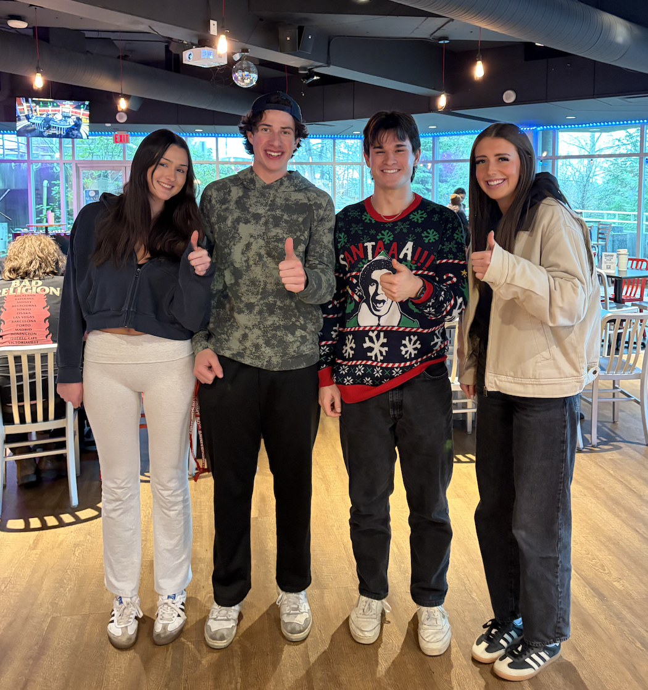

# Meet Our Team

## Davis Sato — Sales & Client Relations
Davis oversees the team’s sales and customer relations division, bringing a strong background in business and hands-on experience. His focus is on building genuine relationships and ensuring every customer enjoys a smooth, positive experience.

---

## Matthew Fleet — Accounting Manager
Matthew brings a clear, analytical mindset to the financial side of the business. As an accounting major, he maintains accuracy, provides stability, and helps guide the team’s decision-making with confidence.

---

## Taya Gannon — Operations Manager
Taya uses her management expertise to ensure daily operations run smoothly. She keeps the team organized, coordinated, and on track, helping projects flow efficiently from start to finish.

---

## Julia MacLachlan — Marketing & Creative Director
Julia, a marketing major, leads the company’s branding and promotions. She shapes the brewery’s visual identity, builds its voice, and designs campaigns that strengthen the company’s presence in the community.



```{r fig-alignment, echo=FALSE, out.width='70%', fig.align='center'}
# This function handles image inclusion across different output formats (HTML/PDF)

```
